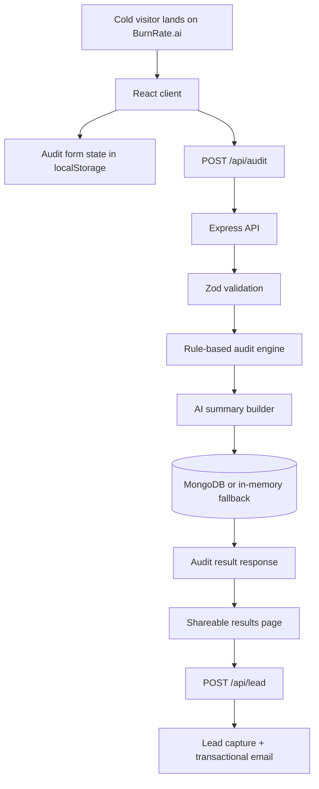

# Architecture

## System Diagram

## Data Flow

1. A visitor lands on the marketing page and clicks into the audit flow.
2. The audit form captures tool name, plan, spend, seats, team size, and use case. Form state is persisted in `localStorage` so a refresh does not wipe progress.
3. The frontend sends the normalized payload to `POST /api/audit`.
4. The backend validates the payload with Zod.
5. The audit engine compares the input against the pricing catalog and recommendation rules. The logic currently focuses on:
   - obvious overpayment vs known plan pricing
   - small-team downgrade opportunities
   - limited use-case based switching
   - credits-backed procurement savings
6. The backend then generates a personalized summary through Anthropic when an API key is available, with a deterministic fallback when it is not.
7. The audit is stored and returned with a public share ID.
8. The frontend routes the user to `/share/:publicId`, renders savings clearly, and offers share + lead-capture actions after value has already been shown.

## Why This Stack

I chose React + Vite on the frontend because the product needs fast iteration on layout, form UX, and shareable results polish more than it needs SSR-heavy complexity on day one. On the backend, Express keeps the service layer simple and readable, which matters because the audit engine and documentation are both evaluated. TypeScript is used across the stack because this project has several moving contracts: tool payloads, audit result shapes, and lead-capture flow.

MongoDB is the intended persistent store because the data model is small, document-oriented, and easy to evolve as audit logic expands. For local development, I added an in-memory fallback so the product can be tested end to end even before infrastructure is fully configured.

## What I’d Change for 10k Audits / Day

At 10k audits per day, I would make four changes quickly:

1. Move pricing logic into a versioned pricing/rules module with a dated release process and regression tests per vendor plan.
2. Shift summary generation to an async job queue so audit creation stays fast even if the LLM provider is slow.
3. Use a real cache layer for public share pages and frequent pricing lookups.
4. Add server-rendered or pre-rendered share pages so Open Graph previews work reliably for crawlers, not only for client-side visitors.

## Trade-off Notes

- The current audit engine is intentionally conservative. It is better to under-claim savings than to sound clever but be financially unserious.
- The share page currently updates metadata client-side, which improves browser presentation but is not a full production-grade OG solution yet.
- API-direct plans are harder to model well because they are usage-based. For a stronger final submission, those cases should evolve toward usage-bucket assumptions documented explicitly in `PRICING_DATA.md`.
