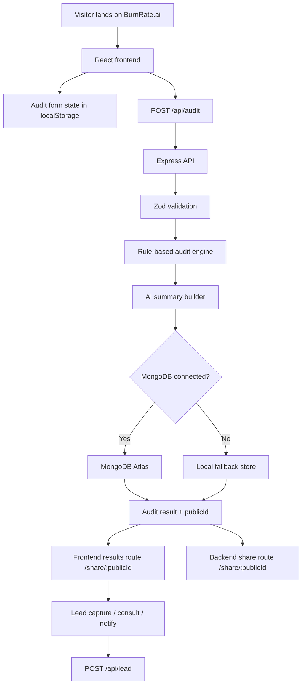

# Architecture

## Overview

BurnRate.ai uses a split frontend/backend architecture:

- a React + Vite client for the product experience
- an Express + TypeScript API for validation, audit logic, persistence, public sharing, and optional service integrations

I chose this structure because the assignment has two very different concerns. The frontend needs to move quickly and feel polished, while the backend needs to keep recommendation logic readable, deterministic, and easy to defend. Separating them made that trade-off cleaner.

## High-Level System

## Core Runtime Flow

### 1. Landing and form state

The visitor starts on the marketing page, then moves to the audit form. Form state is persisted in `localStorage` so that a reload does not erase the audit draft. This was a product requirement in the brief and also a practical UX safeguard, since multi-tool input is annoying to re-enter.

### 2. Audit submission

The frontend sends the audit payload to `POST /api/audit`. The backend validates the payload with Zod before any recommendation logic runs. This keeps malformed or partial data from leaking into the engine.

### 3. Recommendation engine

The audit engine compares user input against a tool catalog and normalized plan definitions. It is strongest in cases where:

- the current plan price is known publicly
- the number of seats makes a lower plan clearly more appropriate
- the product supports a straightforward downgrade path
- spend is obviously better handled via a procurement/credits model

Instead of forcing every input into a fake optimization, the engine is designed to be conservative. If the stack already looks reasonable, it should say so.

### 4. Summary generation

After the numeric result is computed, the backend attempts to generate a short AI summary. This is intentionally a presentation layer, not a decision layer. If Anthropic is unavailable or unaffordable, the product falls back to a deterministic summary so the audit still completes.

### 5. Persistence

Production persistence is handled with MongoDB Atlas. For resilience in local development and degraded environments, the app also supports a local fallback store. That fallback is useful for development and demo continuity, but it should not be treated as the target production mode.

### 6. Public share flow

Each audit receives a `publicId`. There are two share-related routes:

- `GET /api/audit/public/:publicId` returns the public audit data as JSON
- `GET /share/:publicId` on the backend serves an HTML share page for crawlers and redirect behavior

That backend share page then routes users into the frontend `share/:publicId` experience, where the interactive result page loads the public audit again through the API.

### 7. Post-result capture

After the user sees the result, the app supports one of three next-step tones:

- consultation for large savings
- report save/share for medium savings
- notify/report for low savings

This matters because a strong product should not force the same CTA onto every outcome.

## Frontend Structure

### Major areas

- `Home.tsx`: landing page and product framing
- `Audit.tsx`: audit input flow
- `SharedResult.tsx`: public and post-audit result experience
- shared navigation/footer/components for overall structure

### Frontend responsibilities

- rendering the marketing and audit experience
- preserving draft form state
- calling the backend API
- rendering savings, recommendations, and summary
- exposing the public share URL
- capturing post-result lead intent

The frontend does not calculate the savings logic itself. It only renders the result returned by the backend.

## Backend Structure

### Main responsibilities

- input validation
- audit rule execution
- persistence
- share-page generation
- AI summary integration
- optional email integration

### Important routes

- `GET /api/health`
- `POST /api/audit`
- `GET /api/audit/public/:publicId`
- `GET /api/audit/:id`
- `DELETE /api/audit/:id`
- `POST /api/lead`
- `GET /share/:publicId`

## Data Model Design

### Audit

The audit record stores:

- submitted tool inputs
- result totals
- recommendation list
- summary
- `publicId`
- public visibility state

This design keeps the result reproducible and shareable without recalculating the audit on every read.

### Lead

The lead model stores:

- email
- optional company/role/team size
- audit association
- intent (`report`, `notify`, `consult`)
- optional follow-up notes

The lead flow is intentionally downstream of the audit so the product demonstrates value before asking for contact information.

## Why These Technology Choices

### React + Vite

The product needed fast UI iteration more than SSR complexity. Vite kept the feedback loop fast, and React made it easy to separate marketing, form, and results concerns cleanly.

### Express + TypeScript

The backend is simple enough that a heavier framework would have added little value. Express keeps the service readable, which matters in an assignment where architecture explanation is part of the evaluation.

### MongoDB Atlas

The data is document-shaped, relatively small, and evolves around a few central objects. MongoDB is a pragmatic fit for audit results and leads without introducing relational overhead too early.

## Deployment Architecture

- frontend deployed as a Render Static Site
- backend deployed as a Render Web Service
- MongoDB Atlas used for production persistence

This split mirrors the codebase structure and makes environment-specific debugging easier. It also cleanly separates React SPA routing from API behavior.

## Performance and Reliability Notes

- frontend routes are code-split, which helps keep the initial route reasonably small
- backend health check is simple and lightweight
- share pages are served directly by the backend for crawler compatibility
- optional service failures do not block the core audit flow

The current architecture is designed to fail gracefully:

- no Anthropic credits -> fallback summary
- no verified email sender -> email skipped
- no MongoDB -> fallback store for continuity

## Observed Weak Spots

- the deployed frontend still shows layout-shift pressure in Lighthouse, especially around footer movement
- API-direct optimization is less exact than seat-plan optimization because token-level workload data is not collected
- enterprise pricing is necessarily more conservative because many tools do not publish flat enterprise list pricing

## What I Would Change Next

If this moved beyond assignment scope, the next architectural improvements would be:

1. version the pricing catalog and recommendation rules explicitly
2. add a stronger audit-explanation layer for enterprise/API cases
3. queue AI summary generation asynchronously instead of doing it inline
4. add a verified transactional email domain and production email monitoring
5. improve Lighthouse performance by tightening layout stability and reducing main-thread work
