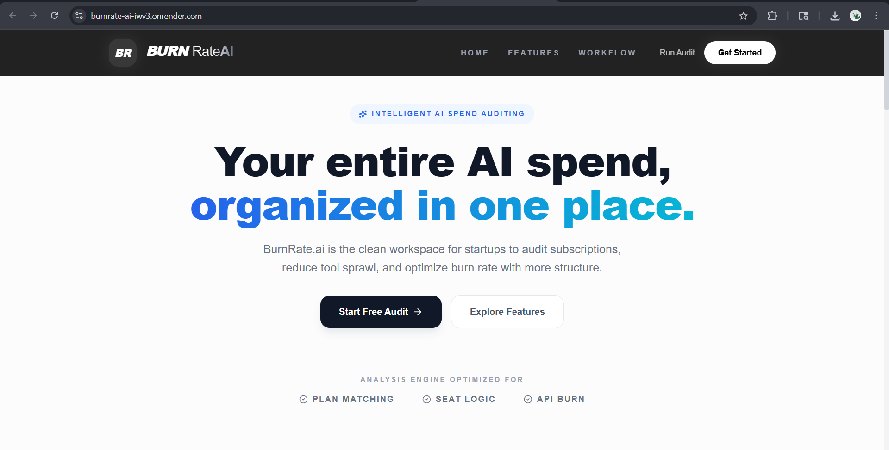
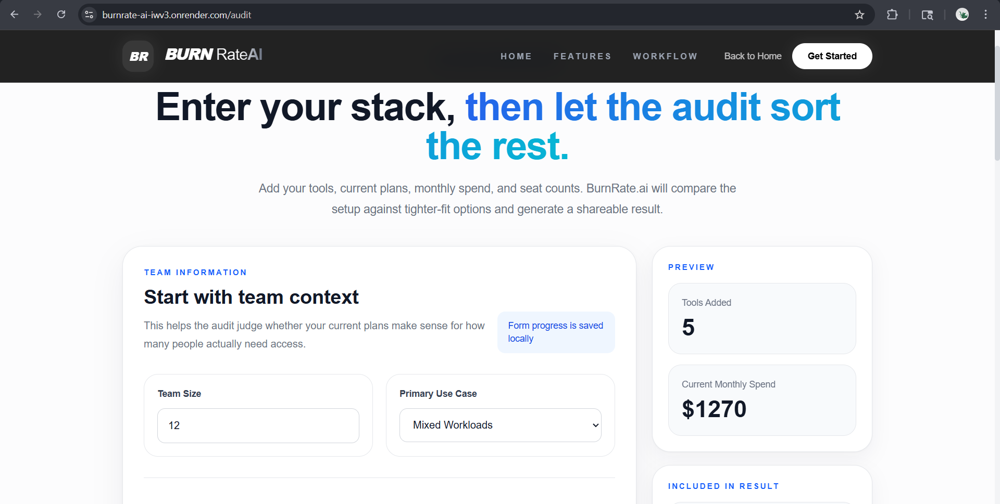
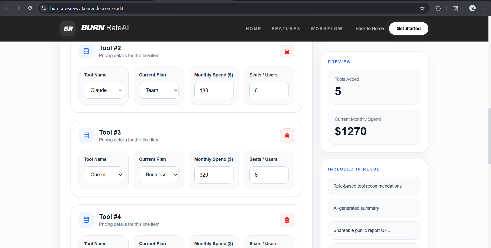
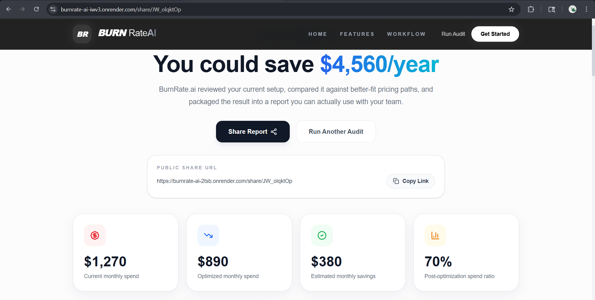
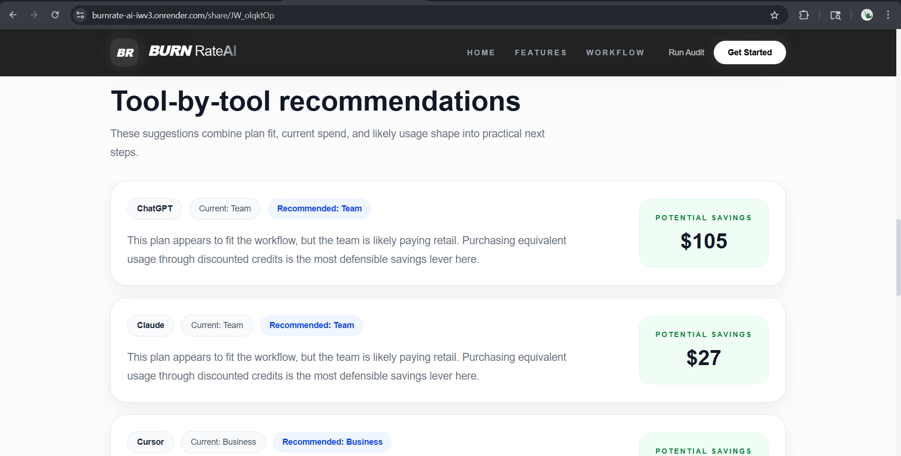
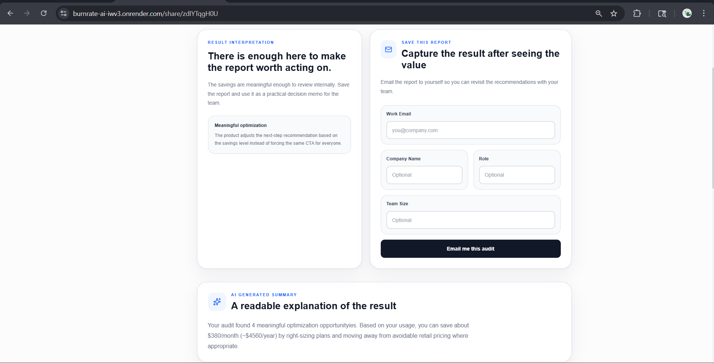

# BurnRate.ai

BurnRate.ai is a free AI spend audit web app built for startup founders, engineering managers, and operators who want a fast second opinion on how their team is paying for AI tools. The product asks for a small amount of structured input, runs a rule-based audit against a pricing catalog, produces a tool-by-tool savings report, and generates a public share link that can be sent to teammates or leadership.

The assignment brief rewards product judgment as much as implementation, so this project was intentionally designed to feel like a narrow but launchable internal-finance tool rather than a generic LLM wrapper. The app shows value before asking for contact details, uses AI only for the narrative summary layer, and keeps the core recommendation engine deterministic and inspectable.

## Live Deployment

- Frontend: [https://burnrate-ai-iwv3.onrender.com](https://burnrate-ai-iwv3.onrender.com)
- Backend API: [https://burnrate-ai-2tsb.onrender.com](https://burnrate-ai-2tsb.onrender.com)
- Health check: [https://burnrate-ai-2tsb.onrender.com/api/health](https://burnrate-ai-2tsb.onrender.com/api/health)

## Product Walkthrough

The screenshots below show the actual deployed product flow, from landing page to structured audit input to shared result output.

### 1. Landing page

The landing page frames the product as a focused AI spend audit rather than a vague AI assistant.



### 2. Audit entry

The audit page starts with team context first, then moves into tool-by-tool inputs. This keeps the flow operational and readable instead of feeling like a generic long form.



### 3. Multi-tool input state

This is the most realistic product-use moment: multiple tools, plans, seat counts, and current monthly spend entered in one place, with a live sidebar preview of the stack.



### 4. Shared result headline

The report leads with the savings summary, the public share URL, and the main result metrics so the output can work both as a user-facing result and as a lightweight internal decision memo.



### 5. Recommendation detail

The recommendation section shows the product's core value: tool-by-tool guidance tied to current plan, recommended plan, and an explainable savings delta.



### 6. Post-result capture and summary

The report capture section appears after value is shown, which keeps the product honest and closer to the assignment brief. The AI summary and the follow-up path live in the same flow.



## What The Product Does

- Captures team size, use case, tool plans, seat counts, and current monthly spend
- Persists in-progress audit input in the browser so a refresh does not wipe work
- Runs a rule-based audit engine against a maintained pricing catalog
- Produces current spend, optimized spend, monthly savings, annual savings, and recommendation reasoning
- Generates an AI-written summary when Anthropic is available, with a deterministic fallback when it is not
- Creates a public share URL for each audit
- Supports different post-audit flows for high-savings, medium-savings, and low-savings cases
- Captures report/notify/consult intents after value has already been shown

## Product Decisions

### Why the audit logic is rule-based

The financially important part of this product is not "sounding smart." It is being able to explain, in a grounded way, why a downgrade, switch, or procurement path is being recommended. For that reason, the audit engine is rule-based and price-catalog-backed. The AI model is only used to turn the result into a readable summary.

### Why the product is narrow

The brief could have been approached by supporting dozens of tools with shallow logic. Instead, I prioritized a smaller, stronger catalog with recommendation paths that are legible and defensible. The result is a more believable MVP: less broad, but more trustworthy.

### Why the report is shareable

The best product surface in this assignment is not the form. It is the final report. The project is designed so the results page can act as a lightweight decision memo: something a founder or engineering lead could reasonably paste into Slack or forward internally.

## Current Tool Coverage

The audit catalog currently supports these products:

- ChatGPT
- Claude
- Anthropic API
- OpenAI API
- Cursor
- GitHub Copilot
- Gemini
- Windsurf

Coverage is strongest for flat-price seat plans and more conservative for custom enterprise and API-direct cases. The exact mapping assumptions are documented in [PRICING_DATA.md](D:/Mihran/Git%20(Learning%20Phase)/burnrate-ai/PRICING_DATA.md).

## Stack

### Frontend

- React 19
- TypeScript
- Vite
- Tailwind CSS v4
- React Router
- Axios

### Backend

- Node.js
- Express
- TypeScript
- Mongoose
- Zod
- express-rate-limit

### Infrastructure

- Render static site for frontend
- Render web service for backend
- MongoDB Atlas for persistent storage

## Repository Structure

```text
burnrate-ai/
|-- client/                # React frontend
|-- server/
|   |-- package.json       # wrapper scripts for server workspace
|   `-- src/               # actual Express app, services, models, tests
|-- .github/workflows/     # CI
|-- README.md
|-- ARCHITECTURE.md
|-- TESTS.md
`-- PRICING_DATA.md
```

## Local Development

### Frontend

```bash
cd client
npm install
npm run dev
```

### Backend

```bash
cd server/src
npm install
npm run dev
```

### Build and verify

```bash
cd client
npm run lint
npm run build

cd ../server
npm run build
npm run test
```

## Environment Variables

### Frontend

```env
VITE_API_BASE_URL=http://localhost:5000/api
VITE_SHARE_BASE_URL=http://localhost:5000
VITE_CONSULTATION_URL=mailto:hello@credex.rocks
```

### Backend

```env
PORT=5000
APP_URL=http://localhost:5000
FRONTEND_APP_URL=http://localhost:5173
MONGO_URI=...
ANTHROPIC_API_KEY=...
RESEND_API_KEY=...
EMAIL_FROM=...
```

## Deployed Behavior Notes

- MongoDB Atlas is the intended persistent store in production
- If MongoDB is unavailable, the backend falls back to local file-backed storage for resilience, but that mode should be treated as development-grade rather than production-grade
- If Anthropic is unavailable or out of credits, the app still completes audits and uses a fallback summary
- Email sending is currently optional. The code supports Resend, but a verified sender domain is required for real production email delivery

## CI

The repository includes GitHub Actions CI at [`.github/workflows/ci.yml`](D:/Mihran/Git%20(Learning%20Phase)/burnrate-ai/.github/workflows/ci.yml), which currently runs:

- frontend lint
- frontend production build
- backend production build
- backend automated tests

## Known Trade-offs

- Enterprise plans are handled conservatively because many vendors do not publish a flat self-serve enterprise price
- API-direct tools are modeled more cautiously than seat-based plans because the assignment input captures monthly spend, not token-level workload telemetry
- The public share flow is designed for both browser use and crawler metadata, but the quality of the share preview still depends on deployment routing being configured correctly
- Real production email is intentionally not enabled unless a verified sending domain is available

## Status

The product is now in a strong MVP state:

- core code is implemented
- deployed frontend and backend are live
- public share flow works
- Mongo persistence works in production
- core audit flow is validated end to end

The highest-value remaining work is no longer coding. It is submission polish: documentation quality, pricing evidence rigor, user interviews, and final presentation.
